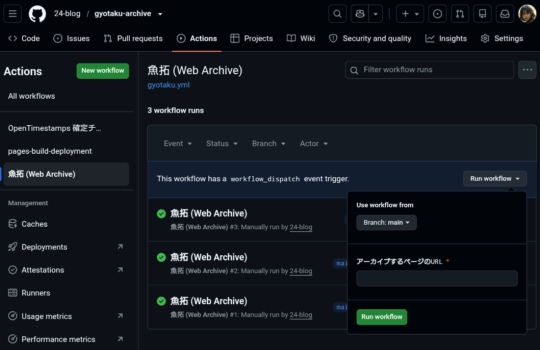

[](LICENSE)


## 魚拓Archiveシステム

WebページのURL・取得日時・保存データ(HTML)・SHA-256ハッシュを記録するアーカイブシステムです。

## 使い方

1. このリポジトリをGitHubにpushし、GitHub Pagesを有効化する。(Settings → Pages → Branch: main / root)

2.  `ots-upgrade.yml` を `.github/workflows/` フォルダ内に追加。

| File name | 
|---|
| `.github/workflows/gyotaku.yml` | 
| `scripts/archive.mjs` | 
| `archives/index.json` | 
| `.nojekyll` |
| `index.html` | 
| `ots-upgrade.yml` |

<p align="center">
  
</p>

3. アーカイブしたいときは、GitHubリポジトリの **Actions** タブ → **魚拓 (Web Archive)** → **Run workflow** を開き、
   `url` にアーカイブしたいページのURLを入力して実行する。
   
4. 実行が完了すると:
   - `archives/` 配下に取得したHTMLがそのまま保存される。
   - `archives/index.json` に以下のメタデータが追記される。
     - `url`: 取得元URL
     - `fetchedAt`: 取得日時(UTC, ISO8601)
     - `file`: 保存したHTMLファイル名
     - `sha256`: 保存データのSHA-256ハッシュ(改ざん検証用)
     - `httpStatus`: 取得時のHTTPステータスコード
     - `byteLength`: 保存データのバイト数

5. GitHub Pagesの `index.html` にアクセスすると、記録した魚拓の一覧が表示される。

## ハッシュの検証方法

保存されたHTMLファイルが改ざんされていないかは、ローカルで以下のように確認できる。

```
shasum -a 256 archives/<ファイル名>.html
```

`archives/index.json` に記録された `sha256` の値と一致すれば取得時点のデータと同一であることが確認できる。

## OpenTimestampsによる第三者タイムスタンプ

`archives/index.json` の `fetchedAt` は、Actions内のスクリプト自身が記録した「自己申告」の時刻であり、リポジトリの書き込み権限があれば理論上書き換え可能。これを補強するため[OpenTimestamps](https://opentimestamps.org/)を使いBitcoinブロックチェーンを使った第三者証明を各アーカイブに付与している。

- アーカイブ実行時、自動的に `archives/<ファイル名>.html.ots` という証明ファイルが生成される。
- 生成直後は「保留中(pending)」の状態。ハッシュがBitcoinブロックに実際に取り込まれるまで、数時間〜1日程度かかる。
- 別ワークフロー(`ots-upgrade.yml`)が毎日自動実行され、保留中の証明を確定状態にアップグレードする。

**確定した証明を検証する方法(要: opentimestamps-clientのインストール):**

```
pip install opentimestamps-client
ots verify archives/<ファイル名>.html.ots
```

成功すると、「このファイルのハッシュ値が、この日時以前にBitcoinブロック番号◯◯に存在していた」ことをAnthropicやGitHubのいずれにも依存せずBitcoinネットワーク自体によって検証できる。

## ローカルで直接実行する場合

GitHub Actionsを使わず、手元で実行することも可能。(Node.js 18以上が必要)

```
node scripts/archive.mjs "https://example.com/page"
```

## 今後の拡張案

- スクリーンショット(headless browser)の追加保存
- 定期実行(cron)による自動巡回アーカイブ
- 一覧ページの検索・タグ絞り込み機能
